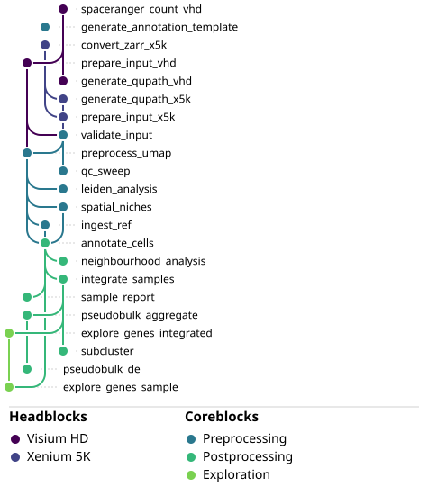

<p align="center">
  
</p>
<p align="center">
  <a href="https://cbib.github.io/SpaceBlocks/"></a>
  <a href="https://github.com/cbib/SpaceBlocks/actions/workflows/tests.yml"></a>
  <a href="https://github.com/cbib/SpaceBlocks/blob/main/LICENSE.md"></a>
  <a href="https://snakemake.github.io/snakemake-workflow-catalog/"></a>
</p>

<p align="center">
  <a href="https://cbib.github.io/SpaceBlocks/">Read the online documentation</a> ·
  <a href="https://cbib.github.io/SpaceBlocks/demos/">Demos</a> ·
  <a href="CONTRIBUTING.md">Contributing</a>
</p>

## Streamlined, reproducible, spatial transcriptomics analyses with Snakemake

SpaceBlocks is a technology-agnostic Snakemake workflow for **semi-automated analysis of single-cell-resolution spatial transcriptomics (ST)**.

It supports scalable and reproducible quality control, clustering, annotation, integration, differential expression, and spatial neighbourhood or niche analysis.

Its modular architecture supports both public and in-house ST datasets while remaining maintainable and extensible.

## Quickstart glossary

- **HeadBlocks** — technology-specific sets of rules that prepare the raw data files into a contract h5ad.
- **CoreBlocks** — technology-agnostic sets of rules that streamline ST processing steps.
- **Contract** — The standardized AnnData h5ad files, validated before running the CoreBlocks.


## Overview

The workflow is divided into (optional) technology-specific **HeadBlocks** and common **CoreBlocks** that streamline pre-, post-processing, and informative exploration of results.

<p align="center"></p>
 
A full SpaceBlocks run takes three inputs:

1. **ST formatted AnnData objects**. Either generated from the HeadBlocks, or manually formatted as a standardized h5ad AnnData object. For brevity, **we refer to each of these objects as THE CONTRACT**. Their structure (count matrix, spatial coordinates and optional region annotations) is validated (`validate_input`) before downstream analyses.

2. **Region annotations**. Provided in GeoJSON format.

3. **Cell type annotations**. Automatically generated through externally annotated references (`ingest`), manually annotating clusters (default) or providing externally generated annotations.

The only mandatory input for SpaceBlocks is the actual ST data (1).

SpaceBlocks provides tools to ease region annotation via QuPath (ideal if collaborating with pathologists) and cell type annotation (either manual, semi-automatic or external).

## Quickstart

SpaceBlocks requires [Snakemake](https://snakemake.readthedocs.io) and Conda/Mamba. The pipeline was developed under Snakemake v9.13.7. The **Visium HD** HeadBlock additionally needs an external [Space Ranger](https://www.10xgenomics.com/support/software/space-ranger) ≥ 4.0.1 installation.

If you are not familiar with Snakemake, there are three key files to configure:

1. `workflow/Snakefile` — loads the config file/s (normally, at `config/config.yaml`), and has the instructions to execute the workflow. It is normally static, so you should not modify it.
2. The `config.yaml` — defines the parameters for your workflow run (i.e. where the input and output should be found, whether to use an external reference for cell type annotation, etc.). **It needs to be configured.** The config may require other files needed for the run (in the case of SpaceBlocks, `config/core_samples.tsv`).
3. The `profiles/config.yaml` — Snakemake is a workflow manager that allows parallelization in systems with job schedulers (i.e. `slurm`), or local execution. **The profile needs to be adapted to your system.**

The full [configuration reference](https://cbib.github.io/SpaceBlocks/configuration/) presents a detailed explanation on how to set `config.yaml`.

We recommend reading the [configuration reference](https://cbib.github.io/SpaceBlocks/configuration/) first, and then starting with the tutorial on [how to streamline a full run](https://cbib.github.io/SpaceBlocks/getting-started), and an [example with public data](https://cbib.github.io/SpaceBlocks/demos/).

> [!TIP]
> Any run can be fully reproduced end-to-end only with the experimental design and cell type annotations.
>
> Color palettes for sample metadata, cell type annotations and spatial niches are fully customizable from `config/config.yaml`.

In short, to run the workflow:

```bash
# 1. Get the workflow  (or: snakedeploy deploy-workflow cbib/SpaceBlocks spaceblocks --tag <version>)
git clone https://github.com/cbib/SpaceBlocks && cd SpaceBlocks

# 2. Configure
#    config/visiumhd_samples.csv   — if running mode : visiumhd
#    config/core_samples.tsv       — one row per sample (+ any design columns)
#    config/config.yaml            — mode: visiumhd | xenium5k | decoupled, and paths
#    profiles/config.yaml          — profiles/default provides an example for slurm

# 3. Check the plan
snakemake -n --sdm conda

# 4. Make the QuPath images, annotate regions in QuPath, then run the core
snakemake qupath_images qc_sweep  --sdm conda   # → annotate, export GeoJSON to config["geojson_path"] + sweep QC thresholds
snakemake run_preprocessing       --sdm conda   # validate → QC/normalise → cluster
snakemake run_postprocessing      --sdm conda   # annotate → integrate → DE → reports + subclusters
snakemake run_exploration         --sdm conda   # explore genes (integrated and per sample)
```

## Documentation

Full, searchable documentation lives at **https://cbib.github.io/SpaceBlocks/**:

- **[Configuration](https://cbib.github.io/SpaceBlocks/configuration/)** — explanation of all config keys and sample sheets.
- **[Get started: recommendations for a full run](https://cbib.github.io/SpaceBlocks/getting-started/)** — how to streamline a full run.
- **[Demos](https://cbib.github.io/SpaceBlocks/demos/)** — public data end-to-end example runs.
- **[QuPath annotation](https://cbib.github.io/SpaceBlocks/qupath-tutorial/)** — tutorial to easily draw and export the region annotations.
- **[Workflow design, architectural decisions and output structure](https://cbib.github.io/SpaceBlocks/design/)** — a brief explanation on the HeadBlock/CoreBlock split, the standardized *contract* h5ad AnnData object, and output tree.
- **[Rule reference](https://cbib.github.io/SpaceBlocks/rules/)** — every rule explained briefly, grouped by HeadBlock/CoreBlock phase.
- **[Outputs](https://cbib.github.io/SpaceBlocks/outputs/)** — what each step produces and why it is useful.
- **[Environments](https://cbib.github.io/SpaceBlocks/environments/)** — the Conda environments and how to lock them.

## Citing SpaceBlocks

If you use SpaceBlocks in your research, please cite:

> _Authors. SpaceBlocks: \<title\>. \<preprint / journal\>, \<year\>. \<DOI\>_

<!-- A BibTeX entry and a Zenodo DOI badge will be added on the first release. -->

## Contributing

Contributions are welcome — see [CONTRIBUTING.md](CONTRIBUTING.md) for the architecture, conventions, and how to validate a change.

## License

Released under the MIT License — see [LICENSE](LICENSE).
