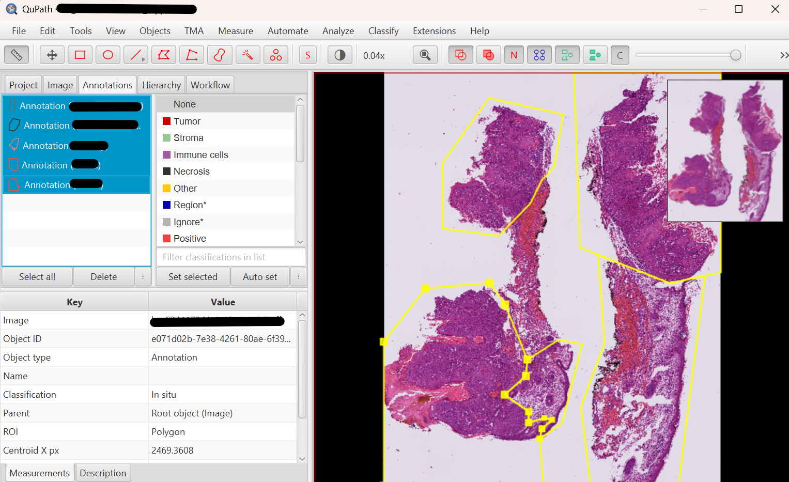
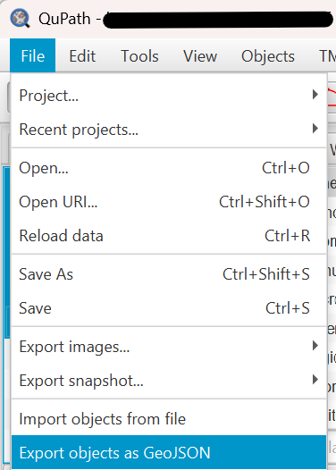
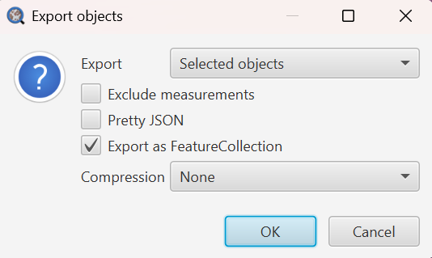

# Index

- [0. QuPath region annotation](#0-qupath-region-annotation)
- [1. Get the image to annotate](#1-get-the-image-to-annotate)
- [2. Annotate in QuPath](#2-annotate-in-qupath)
- [3. Naming convention](#3-naming-convention)

# 0. QuPath region annotation

SpaceBlocks lets you overlay manual **region annotations** (tumour, healthy, necrosis, …) onto your samples. You draw them once in [QuPath](https://qupath.github.io/), export them as GeoJSON, and the pipeline folds them into `obs["region_annotation"]`.

This is an **optional but recommended step** (without it every cell is `Unlabeled`) because it unlocks the region-aware analyses (neighbourhood, per-region co-occurrence, region-level pseudobulk).

Choosing QuPath means anatomopathologists and researchers without bioinformatics skills can annotate the histology directly, while the annotations stay easy to fold back into the AnnData objects.

[Napari](https://napari.org/) is a possible alternative for writting the GeoJSON files, but it is a Python application aimed at programmers.

## 1. Get the image to annotate

| Mode | How to obtain the image |
| --- | --- |
| `visiumhd` / `xenium5k` (a Headblock runs) | `snakemake qupath_images` writes one image per sample under `Samples/{sample}/QuPath_image/` (a hires PNG for Visium HD, a morphology TIFF for Xenium 5K). |
| `decoupled` (no Headblock) | There is no `qupath_images` target — the image is instead **embedded in the contract h5ad** you provided (`uns["spatial"]`). Annotate the regions when you build the contract externally (see [Preparing inputs for decoupled mode](reproduction.md#preparing-inputs-for-decoupled-mode)). |

## 2. Annotate in QuPath

1. Open the image in the QuPath desktop application.
2. Open the `Annotations` tab.
3. Select a region on the tissue image (we recommend the **polygon** tool).
4. Right-click the polygon → *Set classification* → choose the region label.
5. Repeat until the slide is fully annotated.
6. **Select all annotations** → *File* → *Export objects as GeoJSON* → *Export as feature collection*.
7. Save the file following the naming convention below, into the folder referenced by `config["geojson_path"]`.

<table align="center">
  <tr>
    <td align="center"></td>
    <td align="center"></td>
    <td align="center"></td>
  </tr>
  <tr>
    <td align="center"><b>Step 5</b> Select all annotated regions</td>
    <td align="center"><b>Step 6</b> File > Export objects as GeoJSON</td>
    <td align="center"><b>Step 7</b> Save with naming convention</td>
  </tr>
</table>

## 3. Naming convention

| Mode | GeoJSON filename |
| --- | --- |
| Visium HD | `{sample}_tissue_hires_image.geojson` |
| Xenium 5K | `{sample}_morphology.geojson` |

The region labels you set as classifications become the values of `obs["region_annotation"]`; list
them (and their colours) under `analysis.region_levels` / `analysis.region_colors` in
`config.yaml` so they render consistently downstream.
